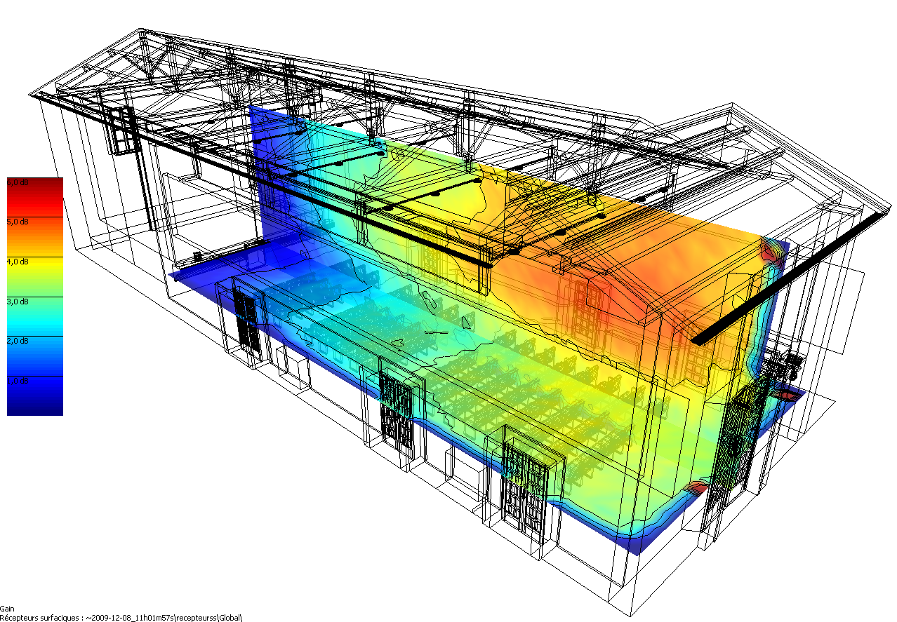

.. I-Simpa documentation master file, created by
   sphinx-quickstart on Mon Aug 22 13:43:57 2016.
   You can adapt this file completely to your liking, but it should at least
   contain the root `toctree` directive.

I-Simpa is a `new generation of noise prediction software for research, engineering and education`_.

**I-Simpa is a graphical user interface (GUI) developed to host three-dimensional numerical codes for the modeling of sound propagation in complex geometrical domains**, and propose many `features`_
Although I-Simpa is well adapted for energetic models (ray-tracing, sound-particle tracing, theory of reverberation…), it can be extend to use ondulatory approaches.

**I-Simpa is distributed with two codes** (`TCR`_ based on the classical theory of reverberation and `SPPS`_ based on particle tracing approach). Classical applications are room and building acoustics, environmental noise and industrial noise, but it can be easily extend to other applications concerning the sound propagation in 3D environments (interior of vehicle, sound in cavities…).

.. _`new generation of noise prediction software for research, engineering and education`: I_Simpa_overview.html
.. _`features`: I_Simpa_features.html
.. _`TCR`: code_TCR.hmtl
.. _`SPPS`: code_SPPS.hmtl

==================
I-Simpa User Guide
==================

This is the **official I-Simpa User Guide**, including the SPPS and
the TCR numerical codes (embedded within the I-Simpa software).

-  for **more information** on I-Simpa, `visit the offical I-Simpa
   website`_
-  for **contributing to I-Simpa** from the source code, follows the
   `instructions`_

.. note::
	-  This user guide is currently not complete. Additions are underway.
	-  Some illustrations may referred to previous versions of I-Simpa.
	-  Depending of your OS, screenchots may differs.
	-  Some texts and translations in I-Simpa may have changed.
	- If the present documentation is the 'Offline documentation' you may refer to the online version at http://i-simpa-wiki.readthedocs.io/en/latest/ for an up-to-date documentation.
	-  If you observe some mistakes or errors, please `write an Issue on GitHub`_
	-  You can also `contribute to the documentation`_.
	-  The official documentation is available in English only.

.. _visit the offical I-Simpa website: http://i-simpa.ifsttar.fr
.. _instructions: https://github.com/Ifsttar/I-Simpa/wiki
.. _contribute to the documentation: https://github.com/Ifsttar/I-Simpa/wiki/Write-documentation
.. _write an Issue on GitHub: https://github.com/Ifsttar/I-Simpa/issues

.. toctree::
   :maxdepth: 2
   :caption: I-Simpa Presentation

   I_Simpa_overview

.. toctree::
   :maxdepth: 2
   :caption: Tutorials

   tutorial_teaching_room
   tutorial_Elmia_hall
   tutorial_industrial_hall

.. toctree::
   :maxdepth: 2
   :caption: I-Simpa User Interface

   setup
   presentation
   menus
   toolbars
   project_window
   properties_window
   console_window
   main_windows
   project_database

.. toctree::
   :maxdepth: 2
   :caption: Thematics

   import_options
   import_file_recommandations
   using_spectrum
   define_position
   surface_selection
   manipulate_sources_receivers
   using_directivity
   create_charts

.. toctree::
   :maxdepth: 2
   :caption: SPPS Code

   code_SPPS
   code_configuration_SPPS
   code_SPPS_principle
   code_SPPS_modelling
   code_SPPS_Validation

.. toctree::
   :maxdepth: 2
   :caption: TCR Code

   code_TCR
   code_configuration_TCR

.. toctree::
   :maxdepth: 2
   :caption: Appendices

   I_Simpa_standard
   room_acoustics_parameters
   glossary
   references

Indices and tables
==================

* :ref:`genindex`

.. * :ref:`modindex`
   * :ref:`search`
